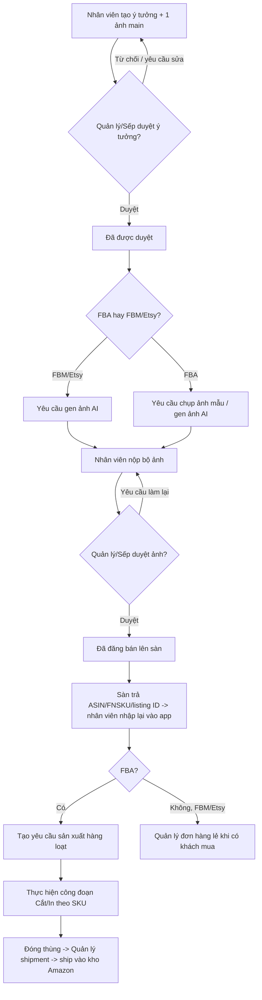

# 01. Mô tả & Tổng quan ứng dụng

> Tài liệu này tổng hợp lại bối cảnh, phạm vi và các khái niệm cốt lõi của dự án, dựa trên bản mô tả nghiệp vụ đã thống nhất (`software-description.md`). Đây là tài liệu nền cho 4 tài liệu còn lại: Công nghệ sử dụng, Yêu cầu chức năng, Thiết kế hệ thống, Thiết kế giao diện.

## 1. Bối cảnh dự án

Công ty kinh doanh mô hình **Print-on-Demand (POD)**: tạo ý tưởng sản phẩm, sản xuất theo yêu cầu, đăng bán trên **Amazon** (FBA và FBM) và **Etsy**. Quy trình hiện tại được quản lý thủ công/rời rạc (spreadsheet, chat...), dẫn tới rủi ro:

- Bỏ sót ý tưởng/sản phẩm ở giữa các khâu (đã sản xuất nhưng quên đăng bán, ảnh đã xong nhưng quên up...).
- Không truy vết được ai làm gì, khi nào — khó quy trách nhiệm khi có sai sót.
- Khó theo dõi tiến độ sản xuất, đơn hàng lẻ, shipment vào kho Amazon.

**Mục tiêu của ứng dụng**: số hóa toàn bộ vòng đời 1 ý tưởng — từ lúc đề xuất, duyệt, làm ảnh, sản xuất, đăng bán, đến khi ra đơn hàng và ship hàng — trong 1 hệ thống duy nhất, nhiều người dùng cùng lúc, có phân quyền và lịch sử thay đổi rõ ràng.

## 2. Đối tượng người dùng & vai trò

Ứng dụng nội bộ (internal tool), không có người dùng bên ngoài (khách hàng không truy cập trực tiếp). 3 vai trò, theo cấp bậc **Sếp > Quản lý > Nhân viên**:

| Vai trò | Mô tả |
|---|---|
| **Nhân viên** | Tạo ý tưởng, làm file thiết kế, làm ảnh, đăng bán sản phẩm, cập nhật sản xuất/đơn hàng/shipment. |
| **Quản lý** | Toàn bộ quyền Nhân viên + duyệt ý tưởng/ảnh, quản lý tài khoản Nhân viên, xem dashboard toàn công ty. Không có quyền với tài khoản Sếp. |
| **Sếp** | Toàn bộ quyền Quản lý + quản lý tài khoản Quản lý. Quyền cao nhất trong hệ thống. |

> Ghi chú: cụm từ "Admin" xuất hiện rải rác trong bản mô tả gốc được hiểu thống nhất là **Quản lý + Sếp** (không phải vai trò thứ 4).

## 3. Phạm vi sản phẩm

### Trong phạm vi (in-scope)
- Quản lý tài khoản người dùng nội bộ (3 vai trò), phân quyền theo từng chức năng.
- Quản lý vòng đời ý tưởng/sản phẩm: tạo → duyệt → làm ảnh → duyệt ảnh → đăng bán.
- Quản lý thông tin đăng bán riêng cho Amazon và Etsy (mỗi sàn 1 bộ field khác nhau).
- Quản lý quá trình sản xuất nội bộ (công đoạn cắt/in linh hoạt theo sản phẩm).
- Quản lý đơn hàng lẻ (FBM/Etsy/personalize) và shipment hàng loạt vào kho Amazon (FBA).
- Thông báo trong ứng dụng (in-app notification).
- Dashboard/thống kê theo nhân viên, theo tháng, theo nguồn ý tưởng.
- Lưu trữ file/ảnh thông qua liên kết Google Drive (không upload file trực tiếp vào hệ thống).

### Ngoài phạm vi (out-of-scope, giai đoạn đầu)
- Tự động đồng bộ 2 chiều với Amazon/Etsy qua API chính thức (SP-API, Etsy Open API) — hiện tại nhân viên **nhập tay** thông tin do sàn trả về (ASIN, listing ID...) sau khi up sản phẩm.
- Tự động sinh ảnh AI (hệ thống chỉ lưu trữ/quản lý ảnh do đội AI tạo ra ở ngoài, không tích hợp AI generation trong app ở bản đầu).
- Quản lý tồn kho thực tế tại kho Amazon (không kết nối FBA Inventory API).
- Ứng dụng dành cho khách hàng cuối (storefront).

> Các hạng mục "ngoài phạm vi" có thể trở thành **Phase 2** sau khi MVP ổn định — xem mục 6.

## 4. Khái niệm cốt lõi (Glossary)

| Thuật ngữ | Ý nghĩa |
|---|---|
| **Ý tưởng / Sản phẩm** | Cùng một bản ghi dữ liệu, chỉ khác tên gọi theo giai đoạn: gọi là "ý tưởng" khi mới đề xuất, gọi là "sản phẩm" khi đã duyệt/sản xuất. |
| **MSKU** | Mã nội bộ tự sinh, không đổi sau khi tạo: `{viết tắt tên nhân viên}{yymm}-{số thứ tự idea trong tháng}`. Dùng để tự quản lý nội bộ, độc lập với SKU do sàn tự sinh. |
| **SKU** | Mã sản phẩm hiển thị trên sàn; mặc định trùng MSKU nhưng có thể chỉnh sửa. |
| **FBA** | Fulfillment by Amazon — Amazon giữ kho và tự ship; cần sản xuất hàng loạt trước, đóng thùng ship vào kho Amazon. |
| **FBM** | Fulfillment by Merchant — công ty tự ship hàng lẻ; không cần sản xuất trước, không cần file thiết kế sẵn. |
| **ASIN** | Mã định danh sản phẩm trên Amazon (10 ký tự, thường bắt đầu "B0"), do Amazon tự sinh sau khi đăng sản phẩm. |
| **FNSKU** | Mã vạch riêng của Amazon, in dán lên từng sản phẩm trước khi nhập kho FBA. |
| **Account (đăng bán)** | Tài khoản Amazon/Etsy dùng để đăng sản phẩm — khác với tài khoản đăng nhập hệ thống. |
| **Trạng thái ý tưởng** | 1 trong 3 giá trị: *đang xem xét → đã được duyệt → đã đăng bán*. |
| **Trạng thái ảnh** | 1 trong 5 giá trị, song song với trạng thái ý tưởng: *chưa yêu cầu làm ảnh → đang chờ làm ảnh → chờ duyệt ảnh → (yêu cầu làm lại ảnh) → đã duyệt ảnh, sẵn sàng đăng bán*. |

## 5. Sơ đồ luồng nghiệp vụ tổng quan

## 6. Đề xuất lộ trình phát triển (Roadmap)

| Giai đoạn | Nội dung |
|---|---|
| **MVP (Phase 1)** | Quản lý tài khoản, Quản lý ý tưởng (đủ trạng thái ý tưởng + ảnh), Thông tin Amazon/Etsy, Quản lý sản xuất, Quản lý đơn hàng, Quản lý shipment, Thông báo, Dashboard cơ bản. |
| **Phase 2** | Tự động hoá nhập liệu qua Amazon SP-API/Etsy API (đồng bộ ASIN, giá, tồn kho), cảnh báo tồn kho sắp hết hàng, export báo cáo Excel/PDF. |
| **Phase 3** | Tích hợp gọi AI sinh ảnh trực tiếp trong app, mở rộng đa sàn (Shopify, TikTok Shop...) nếu công ty mở rộng kênh bán. |

*(Lộ trình là đề xuất ban đầu để tham khảo khi lên kế hoạch phát triển — có thể điều chỉnh.)*
