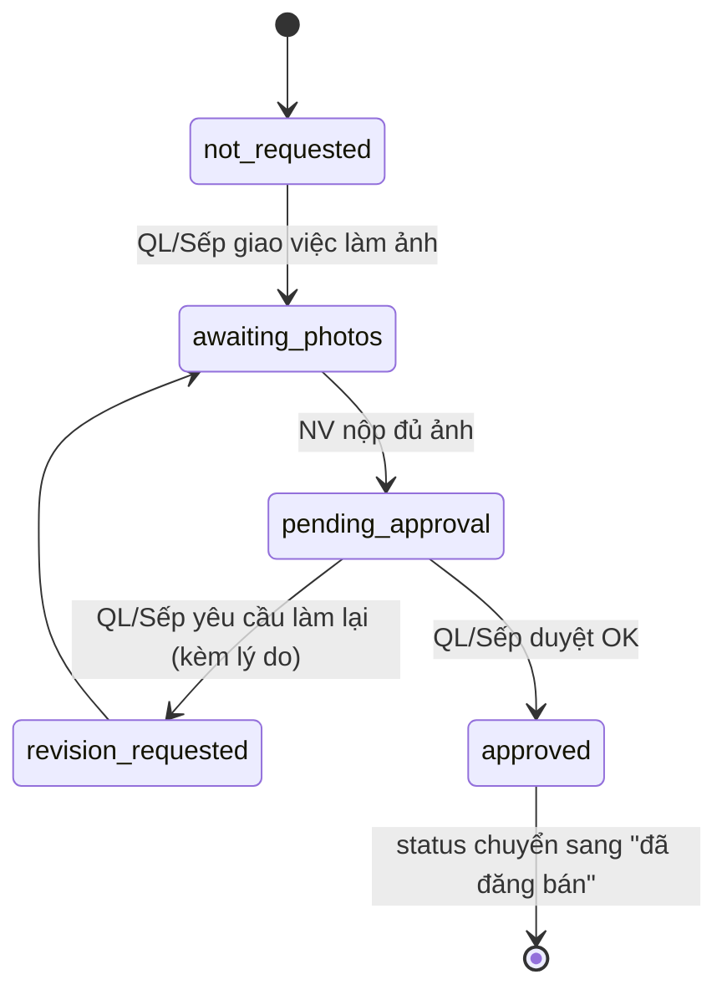

# 03. Yêu cầu chức năng (Functional Requirements Document)

> Quy ước: mỗi module gồm **Mô tả**, **Trường dữ liệu**, **User stories**, **Quy tắc nghiệp vụ (business rules)**, **Tiêu chí chấp nhận**. Nội dung được hệ thống hoá từ `software-description.md` (đã thống nhất qua nhiều vòng trao đổi) sang định dạng chuẩn FRD để bàn giao cho đội phát triển.

---

## Module 1 — Xác thực & Quản lý tài khoản người dùng

### 1.1 Mô tả
Quản lý tài khoản đăng nhập nội bộ cho 3 vai trò: Nhân viên, Quản lý, Sếp. Không có đăng ký công khai — chỉ Quản lý/Sếp tạo tài khoản cho nhân viên mới.

### 1.2 Trường dữ liệu

| Trường | Kiểu | Bắt buộc | Ghi chú |
|---|---|---|---|
| email | string (unique) | ✅ | Dùng làm tên đăng nhập |
| password_hash | string | ✅ | Hash bcrypt/argon2, tối thiểu 8 ký tự khi nhập |
| full_name | string | ✅ | |
| role | enum(`employee`, `manager`, `boss`) | ✅ | |
| status | enum(`active`, `inactive`) | ✅ | Mặc định `active` |
| start_date | date | ✅ | Mặc định ngày hiện tại, có thể sửa |
| name_abbreviation | string | tự sinh | Dùng để sinh MSKU — xem quy tắc 1.4 |
| created_at / updated_at | datetime | tự sinh | |

### 1.3 User stories

- *Là Sếp/Quản lý*, tôi muốn tạo tài khoản cho nhân viên mới, để họ có thể đăng nhập và bắt đầu làm việc.
- *Là Nhân viên*, tôi muốn đăng nhập bằng email/mật khẩu, để truy cập hệ thống.
- *Là bất kỳ vai trò nào*, tôi muốn chỉnh sửa thông tin cá nhân của mình, để cập nhật khi cần.
- *Là Sếp*, tôi muốn vô hiệu hoá tài khoản của Quản lý hoặc Nhân viên khi họ nghỉ việc, để ngăn đăng nhập nhưng vẫn giữ dữ liệu họ từng tạo.

### 1.4 Quy tắc nghiệp vụ

**Phân quyền chi tiết:**

| Chức năng | Nhân viên | Quản lý | Sếp |
|---|---|---|---|
| Tạo ý tưởng, làm file, đăng bán sản phẩm | ✅ | ✅ | ✅ |
| Xem ý tưởng của chính mình | ✅ | ✅ | ✅ |
| Xem toàn bộ ý tưởng (toggle "Của tôi" / "Toàn bộ") | ✅ | ✅ | ✅ |
| Duyệt ý tưởng / duyệt ảnh / yêu cầu chỉnh sửa | ❌ | ✅ | ✅ |
| Xoá ý tưởng bất kỳ lúc nào (không điều kiện) | ❌ | ✅ | ✅ |
| Cập nhật tiến độ sản xuất, đơn hàng, shipment | ✅ | ✅ | ✅ |
| Thêm chủ đề sản phẩm / AI model | ❌ | ✅ | ✅ |
| Thêm tài khoản đăng bán (Amazon/Etsy) | ❌ | ✅ | ✅ |
| Xem dashboard cá nhân | ✅ | ✅ | ✅ |
| Xem dashboard toàn công ty | ❌ | ✅ | ✅ |
| Thêm/sửa/vô hiệu hoá tài khoản Nhân viên | ❌ | ✅ | ✅ |
| Thêm/sửa/vô hiệu hoá tài khoản Quản lý | ❌ | ❌ | ✅ |
| Chỉnh sửa thông tin cá nhân | ✅ | ✅ | ✅ |

**Sinh `name_abbreviation` (dùng cho MSKU) khi tạo tài khoản — áp dụng tuần tự cho tới khi không trùng:**
1. Chữ cái đầu mỗi từ trong họ tên (không dấu). VD: Nguyễn Quốc Huy → `NQH`.
2. Nếu trùng với nhân viên đang `active` khác: giữ chữ cái đầu họ + tên đệm, viết đầy đủ tên chính. VD → `NQHuy`.
3. Nếu vẫn trùng: viết đầy đủ tên đệm. VD → `NQuocHuy`.
4. Nếu vẫn trùng: viết tắt đầy đủ cả họ tên không dấu, liền nhau.
5. Hệ thống tự kiểm tra và gán, không cần nhân viên tự chọn.

**Vô hiệu hoá tài khoản (soft delete):**
- KHÔNG có chức năng xoá cứng (hard delete) tài khoản đăng nhập.
- "Vô hiệu hoá" = chuyển `status = inactive`. Tài khoản không đăng nhập được, nhưng mọi dữ liệu liên quan (ý tưởng, ảnh, file đã tạo) vẫn giữ nguyên liên kết tới người tạo.
- Sếp vô hiệu hoá được tài khoản Nhân viên + Quản lý. Quản lý chỉ vô hiệu hoá được tài khoản Nhân viên.

**Tìm kiếm / Lọc / Sắp xếp:**
- Tìm kiếm theo: email (tên đăng nhập), tên nhân viên.
- Lọc theo: role, status, start_date.
- Sắp xếp theo: start_date, role, status, email.

### 1.5 Tiêu chí chấp nhận
- [ ] Không thể tạo 2 tài khoản trùng email.
- [ ] Quản lý không thể thấy nút sửa/vô hiệu hoá trên tài khoản Sếp (kiểm tra cả UI lẫn API — không chỉ ẩn nút).
- [ ] Tài khoản `inactive` bị chặn đăng nhập (kiểm tra ở tầng Auth.js callback, không chỉ chặn ở UI).
- [ ] `name_abbreviation` không bao giờ trùng giữa 2 tài khoản `active`.

---

## Module 2 — Quản lý ý tưởng / sản phẩm

### 2.1 Mô tả
Module trung tâm của hệ thống — quản lý toàn bộ vòng đời 1 ý tưởng từ lúc tạo tới khi đăng bán.

### 2.2 Trường dữ liệu (bảng `ideas`)

| Trường | Kiểu | Bắt buộc | Ghi chú |
|---|---|---|---|
| sku | string | tự sinh | Mặc định trùng `msku`, có thể sửa |
| msku | string (unique, immutable) | tự sinh | Công thức: `{viết tắt}{yymm}-{số thứ tự 3 chữ số}`. Không sửa được sau khi tạo. |
| created_at | datetime | tự sinh | |
| created_by | FK → users | tự sinh | Theo tài khoản đang đăng nhập |
| source_links | string[] | tối thiểu 1, tối đa 5 | Bỏ query string khi lưu (chỉ giữ path chính) |
| main_image_url | string (Google Drive link) | ✅ bắt buộc | 1 ảnh duy nhất — dùng làm ảnh đại diện toàn hệ thống |
| status | enum(`reviewing`, `approved`, `published`) | tự sinh | Mặc định `reviewing` |
| photo_status | enum(`not_requested`, `awaiting_photos`, `pending_approval`, `revision_requested`, `approved`) | tự sinh | Mặc định `not_requested`, chỉ có ý nghĩa sau khi `status = approved` |
| photo_assignee | FK → users, nullable | | Nhân viên được giao làm ảnh |
| photo_revision_note | text, nullable | | Lý do khi `photo_status = revision_requested` |
| fulfillment_type | enum(`FBA`, `FBM`) | ✅ (cho Amazon) | Etsy không cần field này |
| topic | FK → product_topics | ✅ | Danh mục do Quản lý/Sếp quản lý |
| ai_model | FK → ai_models | ✅ | Danh mục do Quản lý/Sếp quản lý |
| prompt | text | ✅ | |
| production_file_url | string (Google Drive folder link), nullable | | Gồm cả file gia công số lượng nếu có, không tách field riêng |

### 2.3 User stories

- *Là Nhân viên*, tôi muốn tạo ý tưởng mới với 1 ảnh main bắt buộc, để Quản lý xem xét và duyệt trước khi tôi đầu tư công sức làm tiếp.
- *Là Quản lý/Sếp*, tôi muốn duyệt hoặc yêu cầu chỉnh sửa ý tưởng, để kiểm soát chất lượng đầu vào.
- *Là Quản lý/Sếp*, tôi muốn giao việc làm ảnh (gen AI hoặc chụp mẫu) cho 1 nhân viên sau khi ý tưởng được duyệt, để chuẩn bị nội dung đăng bán.
- *Là Nhân viên*, tôi muốn biết rõ khi nào mình cần làm ảnh và khi ảnh bị yêu cầu làm lại kèm lý do, để không bị bỏ sót công việc.
- *Là Nhân viên*, tôi muốn xoá ý tưởng của chính mình khi nó còn ở giai đoạn sớm, để rút lại ý tưởng không còn phù hợp mà không cần nhờ Quản lý.
- *Là Nhân viên*, tôi muốn xem được toàn bộ ý tưởng của công ty (không chỉ của mình), để học hỏi cách làm của đồng nghiệp.

### 2.4 Quy tắc nghiệp vụ

**Trạng thái ý tưởng (`status`) — 3 giá trị tuyến tính:**
`đang xem xét` → `đã được duyệt` → `đã đăng bán`. Chỉ Quản lý/Sếp đổi trạng thái thủ công; nếu chính Quản lý/Sếp là người tạo ý tưởng thì không cần bước tự duyệt.

**Trạng thái ảnh (`photo_status`) — song song với `status`, chỉ kích hoạt sau khi `status = approved`:**

**Quy tắc xoá ý tưởng:**
- Nhân viên: xoá được ý tưởng của chính mình **chỉ khi** `status = reviewing`, HOẶC (`status = approved` VÀ `photo_status` thuộc {`not_requested`, `awaiting_photos`}).
- Một khi đã có `production_file_url`, hoặc `photo_status` từ `pending_approval` trở đi, hoặc `status = published` → Nhân viên **không** xoá được nữa.
- Quản lý/Sếp: xoá được bất kỳ lúc nào, nhưng UI phải hiện cảnh báo nếu ý tưởng đã `published` hoặc đang trong quá trình sản xuất (có production request đang mở).

**Tìm kiếm / Lọc / Sắp xếp:**
- Tìm kiếm theo `sku`, `msku`.
- Lọc theo `status`, người tạo, chủ đề, tháng tạo.
- Sắp xếp mặc định theo **view hiện tại** đang xem (xem 2.5), cho phép đổi sang sắp theo người tạo hoặc mức độ ưu tiên sản xuất.

**Lưu trữ link ảnh/file:**
- Link Google Drive dạng `drive.google.com/...` được lưu nguyên trạng trong DB, nhưng khi hiển thị preview phải convert sang dạng `lh3.googleusercontent.com/...` để xem được trực tiếp.
- Link từ nguồn khác (không phải Drive) thì lưu/hiển thị trực tiếp, không convert.

**Lịch sử chỉnh sửa:** mọi thay đổi field quan trọng (status, photo_status, các field thông tin Amazon/Etsy...) phải ghi log: ai sửa, khi nào, **giá trị cũ → giá trị mới**.

### 2.5 Các "view"/danh sách ý tưởng theo giai đoạn (gợi ý UI, chi tiết ở tài liệu Thiết kế giao diện)
1. **Chờ xem xét** (`status = reviewing`) — sắp theo `created_at`.
2. **Chờ làm ảnh** (`status = approved`, `photo_status` ∈ {`not_requested`, `awaiting_photos`, `pending_approval`, `revision_requested`}) — sắp theo thời điểm `status` chuyển sang `approved`.
3. **Sẵn sàng đăng bán** (`photo_status = approved`, `status` chưa `published`).
4. **Đã đăng bán** (`status = published`).

### 2.6 Tiêu chí chấp nhận
- [ ] Tạo ý tưởng không có ảnh main → form chặn submit, highlight rõ field lỗi.
- [ ] `msku` không thể sửa qua API dù gửi field này trong request update.
- [ ] Nhân viên gọi API xoá ý tưởng ở trạng thái không hợp lệ → trả lỗi 403, không xoá.
- [ ] Mọi lần đổi `status`/`photo_status` đều có bản ghi lịch sử kèm giá trị cũ/mới.

---

## Module 3 — Thông tin đăng bán Amazon (bảng `amazon_listings`, 1-1 với `ideas`)

### 3.1 Trường dữ liệu

| Trường | Kiểu | Bắt buộc | Ghi chú |
|---|---|---|---|
| asin | string(10) | sau khi đăng | Hầu hết bắt đầu "B0"; sách dùng ISBN nên có thể toàn số |
| fnsku_code | string | sau khi đăng | |
| fnsku_label_file_url | string (Drive link) | sau khi đăng | File in nhãn FNSKU (PDF) |
| item_name | string ≤ 75 ký tự | ✅ | Title trên Amazon |
| item_highlights | string ≤ 125 ký tự | ✅ | **Khác** với 5 bullet points bên dưới |
| bullet_points | string[5] | ✅ | |
| description | text | ✅ | |
| tags | string ≤ 500 ký tự, phân tách `;` | tuỳ chọn | |
| slugs | string[] ≤ 12, phân tách `\n` | tuỳ chọn | Tên ảnh thân thiện SEO |
| selling_account_id | FK → selling_accounts | ✅ | |
| price | decimal | ✅ | |
| use_shared_main_image | boolean | | true = dùng ảnh main chung của ý tưởng |
| gallery_images | string[] ≤ 9 | | Ảnh đầu tiên = main nếu `use_shared_main_image = false` |
| video_url | string, nullable | | |
| content_a_plus_url | string, nullable | | |
| listing_status | enum(`pending_review`, `editing`, `ready_to_publish`, `published`) | | Riêng cho Amazon — xem 3.3 |

> `amazon_link` **không lưu trong DB** — tính ở frontend: `amazon.com/dp/{asin}`.

### 3.2 Quy tắc nghiệp vụ
- Chỉ hiển thị/nhập được sau khi `photo_status = approved`.
- `item_highlights` ≠ `bullet_points` — 2 field độc lập, không tự động copy giá trị qua lại.
- `listing_status` độc lập với Etsy: 1 ý tưởng có thể đã bán trên Amazon nhưng chưa đăng Etsy hoặc ngược lại.

### 3.3 Trạng thái đăng bán theo sàn (áp dụng cho cả Amazon & Etsy, lưu riêng mỗi sàn)
`chờ duyệt` → `đang chỉnh sửa` → `sẵn sàng đăng bán` → `đã up`.

---

## Module 4 — Thông tin đăng bán Etsy (bảng `etsy_listings`, 1-1 với `ideas`)

### 4.1 Trường dữ liệu

| Trường | Kiểu | Bắt buộc | Ghi chú |
|---|---|---|---|
| title | string | ✅ | |
| listing_id | string, nullable | tuỳ chọn | Có thể không tiết lộ |
| tags | string[] ≤ 13, mỗi tag ≤ 20 ký tự | tuỳ chọn | Giới hạn khác Amazon |
| bullet_points | string[5] | ✅ | |
| description | text | ✅ | |
| price | decimal | ✅ | |
| selling_account_id | FK → selling_accounts | ✅ | |
| use_shared_main_image | boolean | | |
| gallery_images | string[] ≤ 9 | | |
| use_amazon_gallery | boolean | | true = dùng chung bộ ảnh với Amazon |
| video_url | string, nullable | | |
| use_amazon_video | boolean | | true = dùng chung video với Amazon |
| listing_status | enum(`pending_review`, `editing`, `ready_to_publish`, `published`) | | Riêng cho Etsy — xem 3.3 |

### 4.2 Quy tắc nghiệp vụ
- Etsy gần như luôn được list, không phân biệt FBA/FBM như Amazon.
- `listing_status` độc lập với Amazon — xem 3.3.

---

## Module 5 — Quản lý tài khoản đăng bán (Selling Accounts)

### 5.1 Trường dữ liệu (bảng `selling_accounts`)

| Trường | Kiểu | Ghi chú |
|---|---|---|
| platform | enum(`amazon`, `etsy`) | |
| name | string | Tên hiển thị tài khoản |
| status | enum(`active`, `inactive`) | |
| created_by | FK → users | Chỉ Quản lý/Sếp |

### 5.2 Quy tắc nghiệp vụ
- Chỉ Quản lý/Sếp được thêm.
- **Không có chức năng xoá** — kể cả khi tài khoản ngừng dùng (tránh lỗi/trống dữ liệu ở các ý tưởng đã đăng trên tài khoản đó).
- Khi tài khoản ngừng dùng: chuyển `status = inactive`. Form chọn `selling_account_id` khi đăng bán sản phẩm mới **không gợi ý** các tài khoản `inactive`.

---

## Module 6 — Quản lý quá trình sản xuất

### 6.1 Mô tả
Quản lý các yêu cầu sản xuất hàng loạt (chủ yếu cho hàng FBA). Một SKU bán chạy có thể có **nhiều yêu cầu sản xuất** theo thời gian (mỗi đợt là 1 bản ghi riêng).

### 6.2 Trường dữ liệu (bảng `production_requests` + bảng con `production_steps`)

**`production_requests`:**

| Trường | Kiểu | Ghi chú |
|---|---|---|
| idea_id | FK → ideas | Bắt buộc — xác định sản xuất cho SKU/MSKU nào |
| priority | enum(`urgent`, `priority`, `normal`) | |
| requested_at | datetime | Mặc định thời điểm tạo (sau khi file sx đã duyệt) |
| requested_qty | int | Số lượng yêu cầu |
| actual_qty | int, nullable | Số lượng thực tế sản xuất được |
| completed_at | datetime, nullable | Thời điểm đóng thùng xong |
| note_for_workers | text, nullable | Ghi chú của Quản lý dành cho thợ |

**`production_steps`** (1 production_request có nhiều step, thứ tự linh hoạt theo sản phẩm):

| Trường | Kiểu | Ghi chú |
|---|---|---|
| production_request_id | FK | |
| step_name | enum(`cutting`, `printing`, ...) | Không cố định thứ tự Cắt→In |
| sequence_order | int | Thứ tự thực hiện step này trong đợt sản xuất |
| performed_by | string (chọn từ danh sách tên, KHÔNG phải FK tài khoản đăng nhập) | Dropdown chọn tên — máy xưởng dùng chung, không bắt đăng nhập |
| started_at | datetime, nullable | |
| finished_at | datetime, nullable | |

### 6.3 User stories
- *Là Quản lý*, tôi muốn tạo yêu cầu sản xuất gắn với 1 SKU cụ thể, để xưởng biết cần làm gì.
- *Là Quản lý*, tôi muốn định nghĩa danh sách công đoạn linh hoạt theo từng sản phẩm (chỉ Cắt, chỉ In, hoặc Cắt→In, hoặc In→Cắt), vì không phải sản phẩm nào cũng theo 1 quy trình cố định.
- *Là thợ xưởng*, tôi muốn ghi nhận mình là người thực hiện 1 công đoạn bằng cách chọn tên từ danh sách có sẵn, mà không cần đăng nhập riêng vào máy dùng chung.

### 6.4 Quy tắc nghiệp vụ
- Mỗi `production_step` có `started_at`/`finished_at` riêng để tránh 2 người cùng xử lý 1 công đoạn trùng thời điểm (UI nên khoá nút "Bắt đầu" nếu step đã có người bắt đầu mà chưa kết thúc).
- Danh sách công đoạn mặc định có thể được định nghĩa sẵn theo `topic` (chủ đề sản phẩm) để không phải nhập tay mỗi lần — *(đề xuất tối ưu hoá, không bắt buộc ở MVP)*.
- Sắp xếp danh sách yêu cầu sản xuất theo `priority` (giảm dần) hoặc theo `requested_at`.

### 6.5 Tiêu chí chấp nhận
- [ ] Không tạo được `production_request` thiếu `idea_id`.
- [ ] 1 `idea` có thể có nhiều `production_request` (kiểm tra không bị giới hạn 1-1).
- [ ] Step sau không bị bắt buộc phải tạo sau khi step trước `finished_at` — vì thứ tự linh hoạt theo sản phẩm, hệ thống chỉ lưu `sequence_order` do người dùng xác định, không tự suy luận thứ tự.

---

## Module 7 — Quản lý đơn hàng (đơn lẻ FBM/Etsy/Personalize)

### 7.1 Mô tả
Quản lý các đơn hàng lẻ — không đi qua kho FBA mà ship trực tiếp (FBM, Etsy, hoặc đơn personalize cần làm file riêng theo yêu cầu khách).

### 7.2 Trường dữ liệu (bảng `orders`)

| Trường | Kiểu | Ghi chú |
|---|---|---|
| platform | enum(`amazon`, `etsy`) | |
| tracking_number | string, nullable | |
| order_date | date | |
| customer_name | string | |
| customer_phone | string | |
| address_line1 / address_line2 | string | |
| city / state / zipcode / country | string | |
| order_id | string | Mã đơn trên sàn |
| item_detail | text | |
| weight | decimal | |
| length / width / height | decimal | |
| service | string | Thường là "US Express" |
| quantity | int | |
| sku | string | |
| unit_price | decimal | |
| selling_account_id | FK → selling_accounts | |
| custom_note | text, nullable | Ghi chú cá nhân hoá (đơn personalized) |
| product_image | string (suy ra từ `sku`/`msku`) | |
| tracking_uploaded | boolean | ✅/❌ — đã điền tracking lên sàn cho khách theo dõi chưa |
| production_status | enum(`producing`, `produced`, `awaiting_fulfillment`, `fulfilled`, `ff_amz`) | |
| designer | FK → users, nullable | Xem quy tắc 7.3 |
| order_production_file_url | string (Drive link), nullable | Cho đơn personalize cần làm file riêng |
| producer | FK → users, nullable | Thường 1 người duy nhất phụ trách |
| design_file_url | string, nullable | Lấy từ `production_file_url` của `idea` tương ứng qua `sku` |
| product_link | string | Tự tính từ `asin` hoặc `listing_id` |
| note | text, nullable | |

### 7.3 Quy tắc nghiệp vụ
- **Người thiết kế (`designer`)**: đơn cá nhân hoá → người trực tiếp làm file theo yêu cầu khách; đơn FBA thường dùng lại thiết kế có sẵn nên mặc định là người đã tạo `production_file_url` ban đầu (trừ khi có người khác đăng file mới cho đơn này).
- Nếu `order_production_file_url` để trống, người thiết kế là người **chỉnh sửa link file lấy từ SKU**; nếu có upload file mới riêng cho đơn thì người đó là người thiết kế.
- `design_file_url` có thể **không tồn tại** với đơn FBM/Etsy (vì các đơn này không cần sản xuất số lượng trước khi đăng bán).
- `tracking_uploaded` là checkbox đơn giản (✓/✗), không phải dropdown/text tự do.

### 7.4 Tiêu chí chấp nhận
- [ ] `product_image` tự hiển thị đúng dựa theo `sku`/`msku` nhập vào, không cần chọn ảnh thủ công.
- [ ] `product_link` tự tính đúng theo `asin` (Amazon) hoặc `listing_id` (Etsy), không lưu cứng trong DB.

---

## Module 8 — Quản lý Shipment (lô hàng vào kho Amazon FBA)

### 8.1 Mô tả
Quản lý các thùng hàng (box) ship vào kho Amazon trong từng đợt (shipment). 1 shipment có thể gồm nhiều thùng; 1 SKU có thể được chia vào nhiều thùng đi nhiều kho khác nhau.

### 8.2 Trường dữ liệu

**Cấp Shipment/Box (`shipment_boxes`):**

| Trường | Kiểu | Ghi chú |
|---|---|---|
| ship_date | date | |
| amazon_account_id | FK → selling_accounts | |
| shipment_id | string | Mã shipment do Amazon cấp, riêng theo từng thùng |
| box_name | string | VD: "Box 1", "Box 2" |
| warehouse_code | string | Mã kho đến |
| label_file_url | string (Drive PDF link) | Chứa mã vận đơn + shipment ID + SKU |
| ship_line | string | VD: SEA / SBay / Air VNL — gợi ý sẵn 3 lựa chọn này, cho phép tự điền thêm hoặc gợi ý theo lịch sử đã nhập |
| length_cm / width_cm / height_cm | decimal | Nhân viên nhập |
| weight_kg | decimal | Nhân viên nhập |
| length_in / width_in / height_in | decimal | Tự tính từ cm |
| weight_lb | decimal | Tự tính từ kg |
| tracking_number | string | |

**Cấp SKU-trong-Box (`shipment_box_items`, many-to-many giữa box và SKU):**

| Trường | Kiểu | Ghi chú |
|---|---|---|
| shipment_box_id | FK | |
| idea_id | FK → ideas | Lấy `msku`, ảnh, `fnsku` từ đây |
| qty_per_box | int | |
| total_box_count | int | Tổng số thùng chứa SKU này **trong shipment hiện tại** |
| total_qty | int | Tự tính = `qty_per_box` × `total_box_count` |

### 8.3 Quy tắc nghiệp vụ (ví dụ minh hoạ từ nghiệp vụ thực tế)
> 5 SKU A(90), B(90), C(90), D(100), E(100) chia vào 10 thùng. A/B/C chia đều 5 thùng (18 sp/thùng); D/E mỗi SKU 5 thùng (20 sp/thùng) — mỗi thùng đi 1 kho khác nhau.

- Kích thước/cân nặng nhập bằng cm/kg, hệ thống tự quy đổi sang inch/lb để hiển thị song song (Amazon yêu cầu đơn vị inch/lb).
- `total_box_count` và `total_qty` là số liệu tổng hợp theo SKU **trong phạm vi 1 shipment**, không phải luỹ kế toàn thời gian.

### 8.4 Tiêu chí chấp nhận
- [ ] Đổi cm→inch và kg→lb chính xác, hiển thị ngay khi nhập, không cần bấm nút tính riêng.
- [ ] 1 SKU xuất hiện ở nhiều box trong cùng 1 shipment → `total_qty` cộng dồn đúng.

---

## Module 9 — Quản lý thông báo (Notification)

### 9.1 Trường dữ liệu (bảng `notifications`)

| Trường | Kiểu | Ghi chú |
|---|---|---|
| user_id | FK → users | Người nhận |
| type | enum | VD: `idea_approved`, `revision_requested`, `photo_assigned`... |
| message | string | |
| action_url | string, nullable | Nếu có, mở ở **tab mới** khi bấm |
| is_read | boolean | Mặc định false |
| created_at | datetime | |

### 9.2 Quy tắc nghiệp vụ
- Mỗi người dùng có danh sách thông báo riêng (không chia sẻ).
- Thông báo mới → hiện popup (toast, component có sẵn của shadcn/ui) trong vài giây; nếu nhiều thông báo tới liên tiếp thì hiện **lần lượt hết**, không gộp/chặn.
- Thông báo dạng hành động có nút bấm mở `action_url` ở **tab mới**, để không mất ngữ cảnh công việc đang dở ở tab hiện tại.
- Các sự kiện cần bắn thông báo (tối thiểu): ý tưởng được duyệt/từ chối, được giao làm ảnh, ảnh bị yêu cầu làm lại, ảnh được duyệt, được giao là người thiết kế/người sản xuất 1 đơn hàng.

### 9.3 Tiêu chí chấp nhận
- [ ] Đánh dấu đã đọc không xoá thông báo khỏi danh sách (chỉ đổi `is_read`).
- [ ] Bấm nút hành động mở tab mới, tab gốc giữ nguyên trạng thái form đang nhập dở.

---

## Module 10 — Dashboard / Thống kê

### 10.1 Phân quyền xem
Nhân viên chỉ xem thống kê của chính mình. Quản lý và Sếp xem được thống kê toàn bộ nhân viên.

### 10.2 Các thống kê yêu cầu

**A. Thống kê theo nhân viên, theo tháng:**
- Số ý tưởng đã tạo / số ý tưởng đã được duyệt.
- Số bộ ảnh đã làm.
- Số video đã làm.
- Số content A+ đã làm.
- Lọc theo nhân viên (Quản lý/Sếp) và theo tháng.

**B. Thống kê theo liên kết ý tưởng gốc (`source_links`):**
- Với mỗi liên kết nguồn, hiển thị danh sách: liên kết đó đã sinh ra bao nhiêu ý tưởng, và liệt kê các ý tưởng đó (kèm trạng thái).
- Mục đích: biết 1 sản phẩm gốc trên thị trường đã được công ty "lấy cảm hứng" tạo ra bao nhiêu biến thể.

### 10.3 Tiêu chí chấp nhận
- [ ] Nhân viên gọi API thống kê của người khác → trả lỗi 403.
- [ ] Thống kê theo tháng phản ánh đúng theo `created_at`/thời điểm duyệt tương ứng từng chỉ số.

---

## Module 11 — Quản lý Tool (placeholder)

Theo yêu cầu ban đầu: tạo sẵn danh mục quản lý tool, hiện để trống 3 mục "Tool 1", "Tool 2", "Tool 3" — chưa cần định nghĩa chức năng cụ thể, dự phòng cho các tiện ích nội bộ phát sinh sau này (ví dụ: tool tính giá, tool gợi ý từ khoá...).

---

## Yêu cầu phi chức năng (Non-functional Requirements)

| Hạng mục | Yêu cầu |
|---|---|
| **Đa người dùng đồng thời** | Nhiều người cùng sửa danh sách ý tưởng cùng lúc — cần xử lý concurrent update hợp lý (tối thiểu: cảnh báo nếu dữ liệu đã bị người khác sửa trước khi mình lưu). |
| **Audit log toàn hệ thống** | Mọi thay đổi dữ liệu nghiệp vụ quan trọng đều lưu: ai, khi nào, giá trị cũ → giá trị mới. |
| **Lưu trữ file** | Không upload file trực tiếp — toàn bộ ảnh/file sản xuất là **liên kết Google Drive**. Hệ thống chỉ lưu link, tự convert link xem trước khi cần. |
| **Trường bắt buộc/cảnh báo** | Mỗi field quan trọng có icon hỏi-đáp hoặc tooltip hover giải thích cho nhân viên; field bắt buộc phải đánh dấu rõ, và validate khi bấm submit (không chặn nhập liệu giữa chừng, chỉ chặn lúc submit với field "chỉ cảnh báo"). |
| **Tải bộ ảnh hàng loạt** | Có nút tải nhanh toàn bộ bộ ảnh Amazon hoặc Etsy của 1 sản phẩm (đóng gói zip hoặc tải lần lượt). |
| **Phân quyền** | Áp dụng nhất quán ở cả UI (ẩn/khoá control) lẫn API/Server Action (chặn thực sự) — không chỉ ẩn ở giao diện. |

