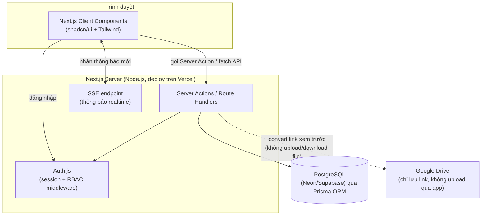
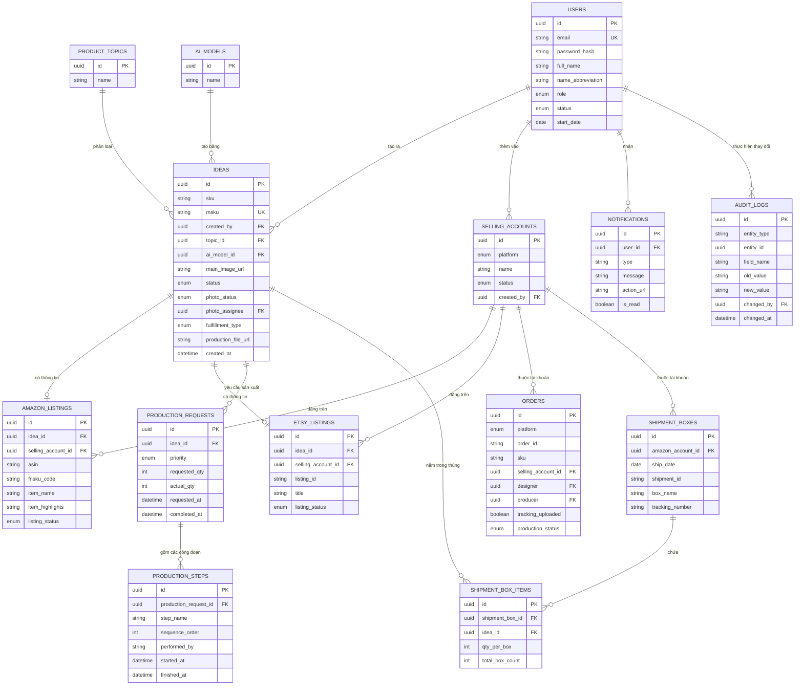
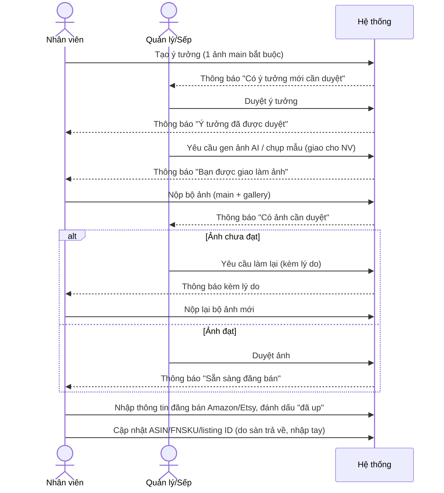
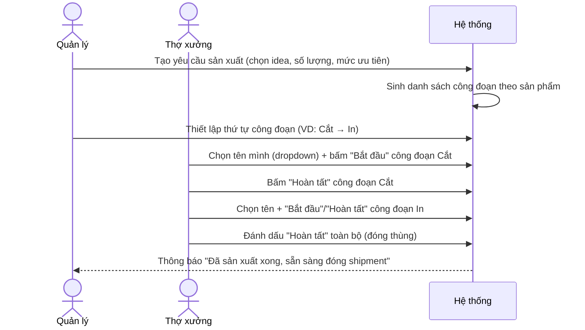

# 04. Thiết kế hệ thống (System Design)

## 1. Kiến trúc tổng thể



**Lý do thiết kế:** team nhỏ, ưu tiên đơn giản — gộp frontend + backend trong 1 Next.js app, không tách microservice. Google Drive chỉ đóng vai trò "kho lưu trữ ngoài", app không cần quyền ghi vào Drive (nhân viên tự upload thủ công và dán link vào app).

## 2. Lược đồ cơ sở dữ liệu (ERD)



> Ghi chú: `ORDERS.sku` tham chiếu lỏng (không phải FK cứng) tới `IDEAS.sku`/`IDEAS.msku`, vì 1 đơn hàng có thể được tạo trước khi có đầy đủ thông tin idea liên kết, hoặc SKU trên sàn có thể bị nhân viên sửa tay khác với hệ thống — xử lý bằng cách tra cứu lúc hiển thị (lookup), không ràng buộc khoá ngoại cứng để tránh chặn nhập liệu khi dữ liệu chưa khớp 100%. *(⚠️ CẦN LÀM RÕ với đội dev: nếu muốn ràng buộc chặt hơn, có thể đổi sang FK thật ở bản sau khi quy trình ổn định.)*

> `AUDIT_LOGS` thiết kế dạng polymorphic (entity_type + entity_id) để dùng chung cho mọi bảng cần lịch sử sửa đổi (ideas, amazon_listings, etsy_listings, orders...), thay vì tạo bảng log riêng cho từng bảng.

## 3. Thiết kế API (Server Actions / Route Handlers)

Quy ước: dùng **Server Actions** cho thao tác CRUD nội bộ (gắn trực tiếp với form), dùng **Route Handlers** (`/api/...`) cho các điểm cần gọi từ client component động (bảng có phân trang/lọc/sắp xếp) hoặc dự phòng tích hợp bên ngoài sau này.

| Nhóm | Endpoint / Action | Mô tả |
|---|---|---|
| Auth | `POST /api/auth/[...nextauth]` | Đăng nhập/đăng xuất qua Auth.js |
| Users | `GET /api/users`, `createUser()`, `updateUser()`, `deactivateUser()` | CRUD tài khoản, có kiểm tra phân quyền theo role |
| Ideas | `GET /api/ideas` (filter/sort/search), `createIdea()`, `updateIdea()`, `deleteIdea()`, `approveIdea()`, `requestRevision()` | |
| Idea — Photo flow | `assignPhotoTask()`, `submitPhotos()`, `requestPhotoRevision()`, `approvePhotos()` | Chuyển `photo_status` theo state machine ở Module 2 |
| Amazon/Etsy listing | `upsertAmazonListing()`, `upsertEtsyListing()` | 1 idea — 1 bản ghi mỗi sàn |
| Selling accounts | `GET /api/selling-accounts`, `createSellingAccount()`, `deactivateSellingAccount()` | Không có `deleteSellingAccount()` |
| Production | `GET /api/production-requests`, `createProductionRequest()`, `addProductionStep()`, `startStep()`, `finishStep()` | |
| Orders | `GET /api/orders` (filter/sort/search), `createOrder()`, `updateOrder()`, `toggleTrackingUploaded()` | |
| Shipments | `GET /api/shipments`, `createShipmentBox()`, `addBoxItem()` | Tự tính inch/lb, tự tính `total_qty` |
| Notifications | `GET /api/notifications`, `markAsRead()`, SSE `GET /api/notifications/stream` | |
| Dashboard | `GET /api/dashboard/employee-stats`, `GET /api/dashboard/source-link-stats` | Áp phân quyền theo role ngay trong query |

**Quy ước response lỗi:** mọi action trả về dạng `{ success: boolean, data?, error?: { code, message } }` để client (React Hook Form) hiển thị lỗi field cụ thể khi cần.

## 4. Luồng dữ liệu chính (Sequence Diagrams)

### 4.1 Luồng duyệt ý tưởng → làm ảnh → đăng bán



### 4.2 Luồng tạo yêu cầu sản xuất (hàng FBA)



## 5. Phân quyền (RBAC) — cách triển khai

- 3 role cố định (`employee`, `manager`, `boss`) — **không cần bảng permissions động trong DB** vì số lượng role/chức năng cố định và ít thay đổi; định nghĩa bảng phân quyền (Module 1, mục 1.4 trong FRD) trực tiếp trong code (`lib/permissions.ts`) dưới dạng object tra cứu `can(role, action)`.
- Áp dụng kiểm tra quyền ở **2 lớp**:
  1. UI: ẩn/khoá control không phù hợp quyền (trải nghiệm tốt hơn).
  2. Server Action/API: luôn kiểm tra lại quyền trước khi thực thi — **không tin tưởng dữ liệu từ client**, vì lớp UI có thể bị bypass.
- Helper gợi ý:
```ts
// lib/permissions.ts
export function can(role: Role, action: Action): boolean { /* tra bảng */ }

// Dùng trong Server Action
export async function deactivateUser(targetUserId: string) {
  const session = await auth();
  if (!can(session.user.role, "deactivate_user")) throw new ForbiddenError();
  // kiểm tra thêm: Quản lý không được đụng tài khoản role = boss
  ...
}
```

## 6. Bảo mật

| Hạng mục | Biện pháp |
|---|---|
| Mật khẩu | Hash bằng bcrypt/argon2, không bao giờ trả password_hash về client |
| Session | Auth.js JWT/DB session, cookie `httpOnly`, `secure`, `sameSite=lax` |
| Input validation | Zod schema dùng chung client/server cho mọi form |
| Brute-force đăng nhập | Giới hạn số lần đăng nhập sai (rate limit theo email/IP) |
| Phân quyền | Kiểm tra ở tầng Server Action như mục 5, không chỉ ở UI |
| Audit log | Không cho sửa/xoá bản ghi `audit_logs` qua bất kỳ API nào (chỉ insert) |

## 7. Xử lý đồng thời nhiều người dùng (Concurrency)

Vì nhiều người có thể cùng sửa 1 ý tưởng/đơn hàng cùng lúc:
- Thêm cột `updated_at`/`version` cho các bảng hay bị sửa đồng thời (`ideas`, `orders`, `production_requests`).
- Khi submit form sửa, gửi kèm `version` đã tải về; nếu `version` ở server đã khác → từ chối lưu, yêu cầu tải lại dữ liệu mới nhất (tránh ghi đè âm thầm — *optimistic locking*).

## 8. Tích hợp Google Drive (link-only, không upload)

- App **không** gọi Google Drive API để upload/download file ở MVP — nhân viên tự upload thủ công lên Drive, dán link vào form.
- Helper `lib/google-drive.ts` chỉ làm 1 việc: nhận diện link dạng `drive.google.com/file/d/{id}/...` và convert sang `lh3.googleusercontent.com/d/{id}` để ``/preview hiển thị được; KHÔNG sửa giá trị gốc lưu trong DB.
