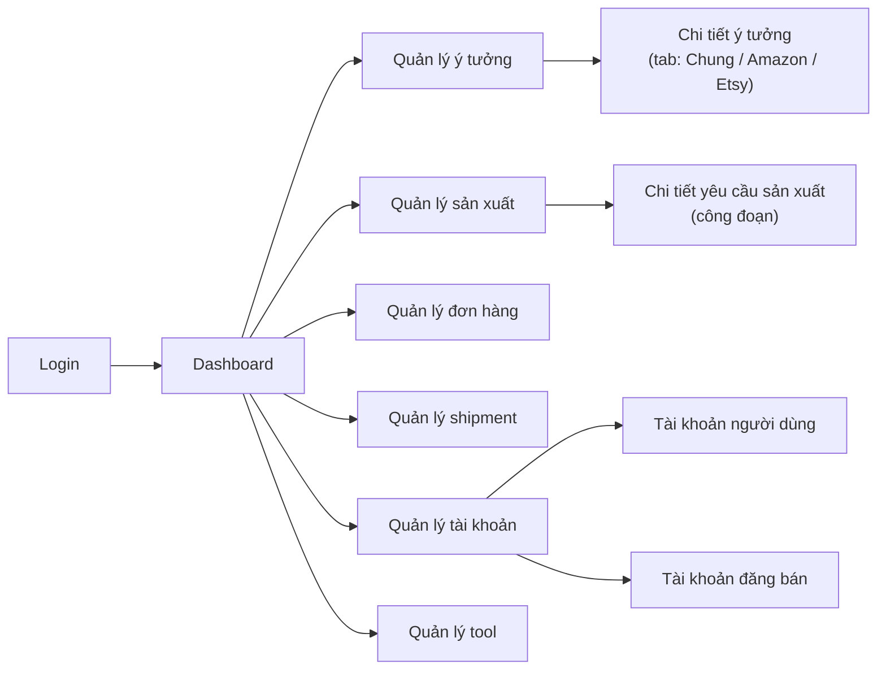

# 05. Thiết kế giao diện (UI/UX Design)

## 1. Định hướng thiết kế

Đây là **công cụ nội bộ** (back-office tool), không phải trang marketing — ưu tiên hàng đầu là **mật độ thông tin rõ ràng, tra cứu nhanh, phân biệt trạng thái dễ dàng** (vì hệ thống có rất nhiều loại trạng thái song song: trạng thái ý tưởng, trạng thái ảnh, trạng thái đăng bán theo từng sàn, trạng thái sản xuất, trạng thái đơn hàng).

Bối cảnh sản phẩm là **xưởng POD thủ công** (cắt/in trên gỗ, mica... cho các sản phẩm như biển khắc, ornament...) — bảng màu và signature lấy cảm hứng từ vật liệu xưởng (giấy kraft, mực in, vết cháy cắt laser) thay vì tông "SaaS tím-xanh" mặc định.

### 1.1 Bảng màu (design tokens)

| Token | Hex | Vai trò |
|---|---|---|
| `--color-paper` | `#FAF6EF` | Nền chính — màu giấy kraft ấm |
| `--color-ink` | `#211D18` | Chữ chính, nền sidebar tối |
| `--color-craft` | `#C2542E` | Accent chính — màu cam-đất nung (gợi vết cháy cắt laser); dùng cho CTA, trạng thái "khẩn cấp/cần chú ý" |
| `--color-pine` | `#33503D` | Accent phụ — dùng cho trạng thái "thành công/đã duyệt/đã hoàn tất" |
| `--color-brass` | `#B8893F` | Accent thứ ba — dùng cho trạng thái "đang chờ/đang xử lý" |
| `--color-slate` | `#6B6358` | Chữ phụ, viền, nền disabled (xám ấm, không dùng xám lạnh mặc định) |

### 1.2 Typography

| Vai trò | Font đề xuất | Lý do |
|---|---|---|
| Display/Heading | **Fraunces** (serif có ink-trap, gợi cảm giác khắc/in ấn) | Tạo cá tính, tránh cảm giác "SaaS generic" của sans mặc định |
| Body/UI | **Inter** | Độ rõ cao ở kích thước nhỏ — quan trọng vì bảng dữ liệu dày đặc |
| Mã/số liệu (SKU, MSKU, ASIN, tracking...) | **JetBrains Mono** | Căn chỉnh đều ký tự, dễ so sánh mã khi rà soát |

### 1.3 Signature element
Đường viền dạng **nét đứt mảnh** (dashed, gợi đường cắt laser) dùng cho viền ảnh main và card ý tưởng — chi tiết nhỏ, nhất quán, không lạm dụng. Trạng thái dùng **badge bo góc nhẹ** (không bo tròn hoàn toàn) màu theo bảng 1.1, không dùng icon mặt cười/emoji để giữ sắc thái chuyên nghiệp.

### 1.4 Layout tổng thể
- **Sidebar trái cố định** (nền `--color-ink`, chữ `--color-paper`): logo, menu theo module, badge số thông báo chưa đọc.
- **Top bar**: ô tìm kiếm nhanh (SKU/MSKU), chuông thông báo, avatar + tên + vai trò người dùng.
- **Khu nội dung chính**: nền `--color-paper`, card bo góc nhẹ (8px), bảng dữ liệu dùng zebra-stripe nhạt để dễ đọc hàng dài.

## 2. Sơ đồ thông tin (Sitemap)

## 3. Danh sách màn hình chi tiết

### 3.1 Đăng nhập
- Form đơn giản: Email, Mật khẩu, nút "Đăng nhập". Không có đăng ký công khai.

### 3.2 Dashboard
- 2 khối thống kê chính (theo FRD Module 10):
  - **Bảng theo nhân viên/tháng**: chọn tháng (mặc định tháng hiện tại), bảng cột = chỉ số (ý tưởng tạo/duyệt, ảnh, video, content A+), hàng = nhân viên. Nhân viên thường chỉ thấy 1 hàng của chính mình; Quản lý/Sếp thấy toàn bộ + có thể sort theo từng cột.
  - **Bảng theo liên kết nguồn**: danh sách `source_link` kèm số ý tưởng phái sinh, click để mở rộng xem danh sách ý tưởng đó (accordion).
- 4 thẻ số liệu nhanh trên cùng: số ý tưởng "chờ xem xét", "chờ làm ảnh", "chờ duyệt ảnh", "sẵn sàng đăng bán" — bấm vào điều hướng thẳng tới view tương ứng ở màn Quản lý ý tưởng.

### 3.3 Quản lý ý tưởng — Danh sách
- 4 tab tương ứng 4 "view" trong FRD (2.5): **Chờ xem xét / Chờ làm ảnh / Sẵn sàng đăng bán / Đã đăng bán**.
- Toggle **"Của tôi" / "Toàn bộ"** ở góc trên (mặc định "Của tôi" cho Nhân viên).
- Mỗi dòng trong bảng: ảnh main (thumbnail viền nét đứt), MSKU/SKU, tên chủ đề, người tạo, badge trạng thái ảnh, ngày tạo/ngày duyệt tương ứng view.
- Thanh filter: trạng thái, người tạo, chủ đề, tháng. Ô tìm kiếm theo SKU/MSKU.
- Nút "+ Tạo ý tưởng" nổi bật góc trên phải (màu `--color-craft`).

### 3.4 Chi tiết / Tạo ý tưởng
- Layout 2 cột: **trái** = ảnh main + khu hành động (nút duyệt/từ chối cho Quản lý, nút "Yêu cầu gen ảnh AI"/"Yêu cầu chụp mẫu", nút "Yêu cầu làm lại ảnh" kèm ô lý do); **phải** = tabs **"Thông tin chung" / "Amazon" / "Etsy"**.
- Mỗi field bắt buộc có dấu `*` đỏ nhạt; field có icon `?` (lucide `circle-help`) hover hiện tooltip giải thích — theo đúng yêu cầu nghiệp vụ.
- Khi submit thiếu field "chỉ cảnh báo" (không bắt buộc tuyệt đối): hiện banner cảnh báo phía trên form + highlight viền cam field liên quan, vẫn cho phép submit nếu nhân viên xác nhận.
- Khu vực **lịch sử thay đổi** (collapsible) ở cuối trang: liệt kê ai sửa gì, khi nào, giá trị cũ → mới (dạng diff, gạch ngang giá trị cũ + mũi tên sang giá trị mới).

### 3.5 Quản lý quá trình sản xuất
- Dạng bảng theo `priority` (badge màu: khẩn cấp = `--color-craft`, ưu tiên = `--color-brass`, bình thường = `--color-slate`).
- Click 1 dòng mở **chi tiết công đoạn**: danh sách step dạng checklist dọc, mỗi step có dropdown "Người thực hiện" + 2 nút "Bắt đầu"/"Hoàn tất" (nút "Bắt đầu" bị khoá nếu step đã có người đang làm dở).

### 3.6 Quản lý đơn hàng
- Bảng dữ liệu dày đặc (nhiều cột) — bật/tắt cột hiển thị (column visibility toggle của shadcn/ui Table) vì số field rất nhiều.
- Cột `tracking_uploaded` hiển thị dạng checkbox trực tiếp trong bảng (tích nhanh không cần mở chi tiết).
- Badge `production_status` màu theo nhóm: đang sx/đã sx = brass, chờ FF/đã FF/FF AMZ = pine.

### 3.7 Quản lý shipment
- Cấu trúc lồng: chọn **Shipment** (ngày + account) → xem danh sách **Box** trong shipment → mở 1 box xem danh sách **SKU trong box**.
- Khi nhập kích thước/cân nặng (cm/kg), giá trị inch/lb hiển thị **ngay bên cạnh, tự cập nhật khi gõ** (không cần nút "Tính").

### 3.8 Quản lý tài khoản
- 2 tab: **Tài khoản người dùng** và **Tài khoản đăng bán**.
- Tab tài khoản người dùng: bảng + nút "Vô hiệu hoá" (không có nút "Xoá"); badge role màu khác nhau (Sếp/Quản lý/Nhân viên).
- Tab tài khoản đăng bán: chỉ có nút "+ Thêm", không có nút xoá; toggle trạng thái "Đang dùng/Ngừng dùng".

### 3.9 Thông báo
- Icon chuông ở top bar mở **dropdown panel** (10 thông báo gần nhất + link "Xem tất cả").
- Trang đầy đủ `/notifications`: danh sách full, filter đã đọc/chưa đọc, nút hành động mở tab mới (icon `external-link` cạnh nút).

### 3.10 Quản lý Tool
- Trang trống với 3 thẻ "Tool 1 / Tool 2 / Tool 3" (placeholder, chưa có chức năng).

## 4. Quy ước component (dựa trên shadcn/ui)

| Nhu cầu UI | Component shadcn/ui |
|---|---|
| Trạng thái (status) | `Badge` (custom màu theo token ở mục 1.1) |
| Bảng danh sách có filter/sort | `Table` + `DropdownMenu` (cột) + `Input` (tìm kiếm) |
| Form tạo/sửa nhanh | `Dialog` (ngắn) hoặc `Sheet` (dài, nhiều field) |
| Toast thông báo | `Sonner`/`Toast` của shadcn/ui |
| Chọn ngày | `Calendar` + `Popover` |
| Chọn nhiều (tags, công đoạn) | `Command` (combobox) |
| Tabs (Chung/Amazon/Etsy) | `Tabs` |
| Tooltip giải thích field | `Tooltip` |
| Lịch sử thay đổi dạng diff | `Accordion` + custom diff renderer |

## 5. Responsive & Accessibility

- **Desktop-first**: các form nhiều field (Tạo ý tưởng, Shipment) tối ưu cho màn hình ≥ 1280px — vì đây là công việc bàn giấy/xưởng dùng máy tính, không phải tác vụ di động.
- **Mobile**: vẫn dùng được cho các tác vụ tra cứu nhanh (Dashboard, xem trạng thái ý tưởng, tích checkbox "đã thêm tracking", đánh dấu "Bắt đầu/Hoàn tất" công đoạn sản xuất tại xưởng) — sidebar thu gọn thành bottom nav hoặc hamburger menu.
- **Keyboard & contrast**: toàn bộ control có focus ring rõ ràng (yêu cầu chuẩn của skill thiết kế); tỉ lệ tương phản chữ/nền đạt tối thiểu WCAG AA, đặc biệt với các badge màu brass/craft trên nền paper.

## 6. Mockup minh hoạ

File `mockup-giao-dien.html` (đính kèm cùng bộ tài liệu) minh hoạ trực quan 3 màn hình: **Dashboard**, **Danh sách ý tưởng**, và **Chi tiết ý tưởng** — thể hiện đúng bảng màu, typography và bố cục mô tả ở trên.
